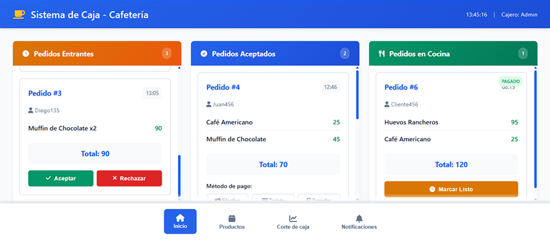
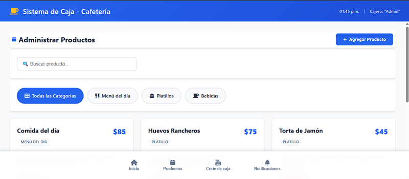
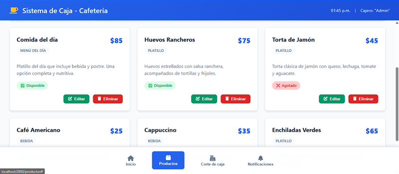
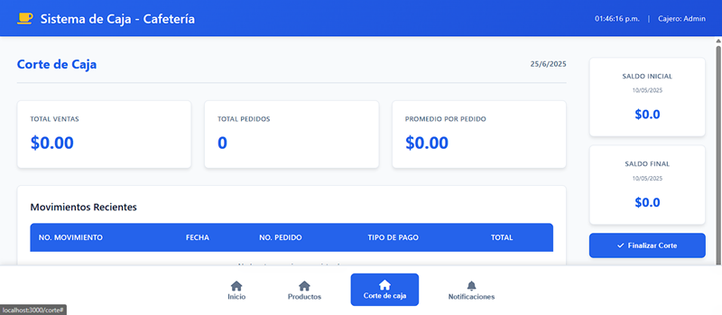
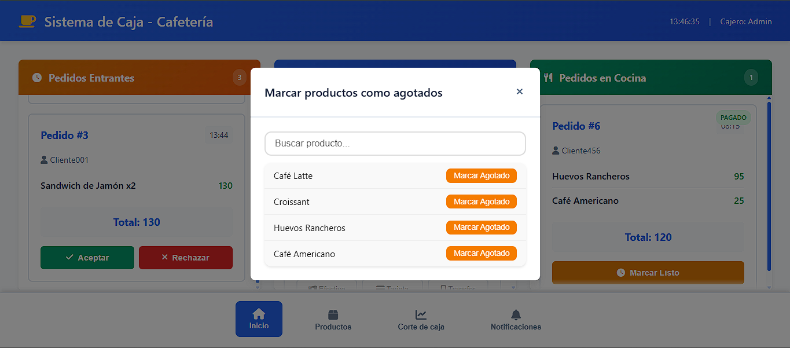

# ☕ Sistema de Caja para una Cafeteria - Sistema Web de Escritorio 

Este es un sistema de caja web diseñado para una cafetería. Permite gestionar de forma sencilla los pedidos de los clientes, los productos disponibles y el control del flujo de efectivo en caja. Desarrollado con tecnologías web modernas como **HTML, CSS, JavaScript y Node.js**.

## 📱 Estado del Proyecto

🚧 **En desarrollo.**  
Actualmente, se está construyendo la estructura base del proyecto, incluyendo:

- **Base de datos local** para almacenar configuraciones y cálculos e historiales.
- Interfaz de **Cobro, Productos, Historial de pedidos y Corte de Caja**.

---

## 📋 Funcionalidades Planeadas

- [ ] Almacenamiento de datos mediante base de datos local.
- [ ] Cálculo del total del pedido y calculos de corte de caja.
  - Generacion automatica de un historial de pedidos.
  - Calculo automatico a partir del historial de pedidos par el **corte de caja**.
- [ ] **Modificación dinámica** de pedios y productos:
  - El usuario podrá **editar y cancelar el pedido** antes de realizar el cobro.
  - Se podrán **agregar, eliminar y modificar productos**.
- [ ] Visualización de resultados:
  - Desglose del costo total del pedido.
  - Historila de pedidos.
  - Totales para corte de caja.

---

## 🛠️ Tecnologías

- **Lenguaje:** HTML, CSS, JS
- **Entorno de desarrollo:** Visual Studio
- **Control de versiones:** Git

---

## 📁 Estructura del Proyecto

```
Sistema_caja/
├── 📁 assets/                    # Recursos estáticos del proyecto
├── 📁 bin/
│   └── www                       # Archivo de configuración del servidor
├── 📁 public/                    # Archivos públicos accesibles desde el cliente
│   ├── 📁 javascripts/           # Scripts del lado del cliente
│   └── 📁 stylesheets/           # Hojas de estilo CSS
├── 📁 routes/                    # Rutas del servidor Express
│   ├── index.js                  # Rutas principales
│   └── users.js                  # Rutas de usuarios
├── 📁 views/                     # Vistas y plantillas
│   ├── corte.ejs                 # Vista del corte de caja
│   ├── error.ejs                 # Vista de errores
│   ├── index.ejs                 # Vista principal
│   └── productos.ejs             # Vista de gestión de productos
├── app.js                        # Archivo principal de la aplicación
├── package-lock.json             # Dependencias bloqueadas
├── package.json                  # Configuración y dependencias del proyecto
├── .gitignore                    # Archivos ignorados por Git
└── README.md                     # Documentación del proyecto
```

### Descripción de Carpetas

- **`assets/`**: Contiene imágenes, capturas de pantalla y otros recursos estáticos utilizados en la documentación.
- **`bin/`**: Archivos de configuración del servidor, incluyendo el punto de entrada principal.
- **`public/`**: Recursos del lado del cliente (CSS, JavaScript, imágenes) accesibles directamente por el navegador.
- **`routes/`**: Define las rutas y endpoints de la API del servidor Express.
- **`views/`**: Plantillas EJS para renderizar las diferentes páginas de la aplicación.
- **`app.js`**: Archivo principal que configura y ejecuta la aplicación Express.
- **`package.json`**: Define las dependencias, scripts y metadatos del proyecto.
  
---

## 📸 Capturas de pantalla

- Interfaz principal

- Productos


- Caja

- Notificaciones


---

## 🚀Cómo usar este proyecto

- Clona este repositorio.
- Instala las dependencias necesarias (npm install).
- Ejecuta el servidor (npm start).
- Abre tu navegador en: http://localhost:3000
- (Asegúrate de tener Node.js instalado en tu equipo).

---

## ❓¿Dónde encontrar ayuda?

Si necesitas ayuda con el proyecto puedes:
- Revisar la documentación en este repositorio.
- Reportar un problema en la sección Issues.
- Contactar directamente con los autores.

---

## 👥 Equipo

- [@tuX-2](https://github.com/tuX-2) - José González
- [@ObjectShalvy](https://github.com/ObjectShalvy) - Salvador Luengas
- [@Omar-art32](https://github.com/Omar-art32) - Omar Jiménez
- [@GeraSP11](https://github.com/GeraSP11) - Gerardo Cortez


---

## 🛡️licencia

Creative Commons

Atribución-NoComercial-SinDerivadas 4.0 Internacional (CC BY-NC-ND 4.0).


  

